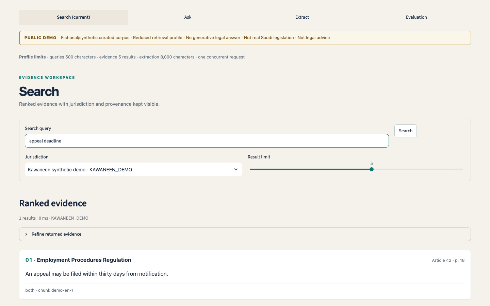

# Kawaneen

Kawaneen is an evaluated Arabic legal-document intelligence platform for
structure-aware ingestion, hybrid BM25+dense retrieval, reranking,
evidence-grounded answers, citation verification, structured extraction, and
safe abstention.

It is a portfolio project built around a real engineering question: how do you
make Arabic legal research inspectable when evidence, provenance, jurisdiction,
and uncertainty matter as much as fluent generation? The repository contains
the serving boundary, retrieval and grounding stack, deterministic extraction,
synthetic public demo, evaluation harnesses, reproducibility records, and
deployment documentation.

**Status:** Portfolio project: complete · Live public demo: prepared and
qualified, not yet published

[](https://github.com/Joseph-Nawar/Kawaneen/actions/workflows/ci.yml)
[](pyproject.toml)
[](LICENSE)



## Why Kawaneen

Arabic legal and regulatory documents are structurally dense, multilingual in
practice, and costly to inspect when a system cannot show where an answer came
from. Kawaneen treats retrieval, source identity, citation support, and
abstention as first-class product behavior rather than wrapping a chatbot
around a search box.

## What is implemented

- **Ingestion:** gated source metadata, parsing/OCR routing, Arabic
  normalization, canonical units, and structure-aware legal chunking.
- **Retrieval:** BM25 and dense baselines combined with weighted reciprocal
  rank fusion, then a frozen BGE reranker for the full local profile.
- **Grounded QA:** answerability policy before generation, bounded context,
  exact provenance, citation verification, and fail-closed abstention.
- **Extraction:** deterministic candidate extraction plus a separately bounded
  experimental hybrid path with source-span validation and exports.
- **Serving:** FastAPI `/v1` contracts, Streamlit research workspace, Docker
  Compose full-local profile, and an intentionally reduced synthetic demo.
- **Evidence:** frozen evaluation artifacts, error analysis, reproducible
  aggregate results, and optional local MLflow metadata-only tracing.

## Measured results

These are tracked results, not claims of legal correctness. Read the linked
reports for populations, confidence intervals, provenance, and limitations.

| Evidence | Measured result | Scope |
| --- | ---: | --- |
| [Structure-aware chunking](docs/reports/phase-15-evaluation-and-experiment-report.md#historical-evidence-phases-3-11-and-14) | nDCG@10 0.6837 vs 0.6394 for fixed-256 | Frozen Phase 5, 180-query challenge |
| [Citation verification](docs/reports/phase-15-evaluation-and-experiment-report.md#citation-verification-counterfactual) | Contract-defect exposure 29/40 → 0/40; absolute risk reduction 0.725 | Phase 15 DEV counterfactual |
| [Arabic embedding comparison](docs/reports/phase-15-evaluation-and-experiment-report.md#arabic-embedding-experiment) | Recall@10 delta +0.0461, CI includes zero | Phase 15 DEV, 141 queries; not promoted |
| [Hard-query reranking](docs/reports/phase-15-evaluation-and-experiment-report.md#hard-query-reranking) | Recall@10 delta +0.0435; 2 wins, 44 ties, 0 losses | Phase 15 DEV enriched slice; inconclusive population effect |
| [Qdrant parity](data/evaluation/phase17_qdrant_parity.json) | 0/20 mismatches; max score error 1.43e-7 at top-k 50 | Phase 17 DEV exact-index parity |

The negative results matter too: the locked 1.5B Arabic fallback produced
invalid outputs on all 80 matched cases, while ALLaM was blocked before scoring
because no trustworthy local 4-bit provenance path was available. These are
documented in the [Phase 15 report](docs/reports/phase-15-evaluation-and-experiment-report.md)
and [safety and limitations](docs/safety-and-limitations.md).

## System architecture

The [deployment diagram](docs/architecture/phase17-deployment.mmd) shows the
two profiles. The authoritative full-local system uses the frozen BGE-M3,
Qdrant exact dense search, BM25, BGE reranking, Ollama Stage-D, verifier, and
optional MLflow traces. The public profile uses only synthetic
`KAWANEEN_DEMO` data, BM25, bundled E5-small vectors, exact NumPy search, and
deterministic evidence output—no Qwen, Ollama, Qdrant, MLflow, private corpus,
or Saudi source text.

## Demo

Existing synthetic UI screenshots are available for [Search](docs/assets/ui/search.png),
[Ask](docs/assets/ui/ask.png), [Extract](docs/assets/ui/extract.png), and
[Evaluation](docs/assets/ui/evaluation.png). They contain no private or
production legal data.

**Demo video — recording pending.** The exact one-pass plan is in the [three-minute
script](docs/demo/three-minute-script.md) and [shot list](docs/demo/shot-list.md).
The eventual file belongs at `docs/demo/kawaneen-demo.mp4`; no live video URL is
claimed here.

## Run it locally

For the public synthetic walkthrough and repository quality checks:

```bash
uv sync --locked --dev --all-extras
# fixture-only visual walkthrough
make ui-demo
```

For the live public synthetic API/UI profile, use two terminals:

```bash
# terminal 1
uv run uvicorn kawaneen.demo.runtime:create_demo_app --factory \
  --host 127.0.0.1 --port 8000

# terminal 2
KAWANEEN_UI_MODE=live KAWANEEN_UI_PUBLIC_DEMO=true \
  KAWANEEN_API_URL=http://127.0.0.1:8000 \
  uv run streamlit run src/kawaneen/ui/app.py
```

For the full local profile, mount the private/local serving artifacts outside
Git and follow [full local deployment](docs/deployment/full-local.md):

```bash
export KAWANEEN_HOST_ARTIFACTS_DIR=/absolute/path/to/private-artifacts
docker compose up --build
```

The full profile is resource-intensive and is not present in a fresh clone.
See the [API examples](docs/deployment/api-examples.md) for `/v1/health`,
`/v1/search`, `/v1/answer`, and `/v1/extract` requests.

## Public synthetic demo

The [public-demo deployment note](docs/deployment/public-demo.md) describes the
qualified reduced profile. It is fictional, bounded, and explicitly not Saudi
law or legal advice. Its local qualification recorded `HF_SPACE_RESOURCE_QUALIFIED`
under a constrained 2-CPU/12-GB request on the measured local platform; this is
not a Hugging Face host-performance claim. Publication remains optional and
unperformed.

## Evaluation and reproducibility

- [Model card](docs/model-card.md): system/component identities, contracts, and
  evaluation evidence.
- [Dataset card](docs/dataset-card.md): private corpus, frozen evaluation
  assets, and synthetic demo boundaries.
- [Safety and limitations](docs/safety-and-limitations.md): canonical public
  safety boundary and known weak results.
- [Phase 15 evaluation report](docs/reports/phase-15-evaluation-and-experiment-report.md):
  DEV experiments, negative results, and error analysis.
- [Phase 16 observability report](docs/reports/phase-16-observability-and-reproducibility.md):
  serving identity, privacy contract, and six-result reconstruction.
- [Portfolio MLflow evidence](docs/mlflow-evidence.md): safe text-only export;
  the SQLite/artifact store remains local and ignored.

Reproduce the tracked aggregate table without private data or model downloads:

```bash
make phase16-verify
```

## Technical stack

Python 3.11–3.12 · FastAPI · Streamlit · BM25 · sentence-transformers · BGE-M3 ·
BGE reranker · Qdrant · Ollama/Qwen3 Stage-D · deterministic extraction ·
Docker Compose · MLflow (optional local observability) · pytest · Ruff · Pyright

## Repository map

Use [docs/README.md](docs/README.md) as the short navigation index. The most
useful first-level paths are:

- `src/kawaneen/` — implementation and serving boundaries.
- `tests/` — unit, integration, regression, UI, and E2E contracts.
- `data/manifests/` and `data/evaluation/` — version-controlled metadata and
  aggregate evidence only.
- `docs/reports/` — historical phase reports and authoritative analysis.
- `docs/deployment/` and `docs/demo/` — local/public runbooks and recording plan.

## Testing and CI

CI runs the quality matrix on Python 3.11 and 3.12 plus the public Docker
Compose E2E job. Locally, `make check` runs formatting, linting, Pyright,
source validation, and the public 85% branch-coverage suite. Additional gates
include `make test-regression`, `make test-e2e`, and `make phase17-verify`.
The full test-layer matrix is in [docs/testing.md](docs/testing.md).

## Safety and license

Kawaneen is not legal advice and does not guarantee legal correctness. It is a
research/portfolio system with explicit jurisdiction, provenance, privacy, and
abstention boundaries. See [SECURITY.md](SECURITY.md) for reporting guidance
and [safety-and-limitations](docs/safety-and-limitations.md) for the full
public boundary.

Released under the [MIT License](LICENSE). Citation metadata is in
[CITATION.cff](CITATION.cff).
