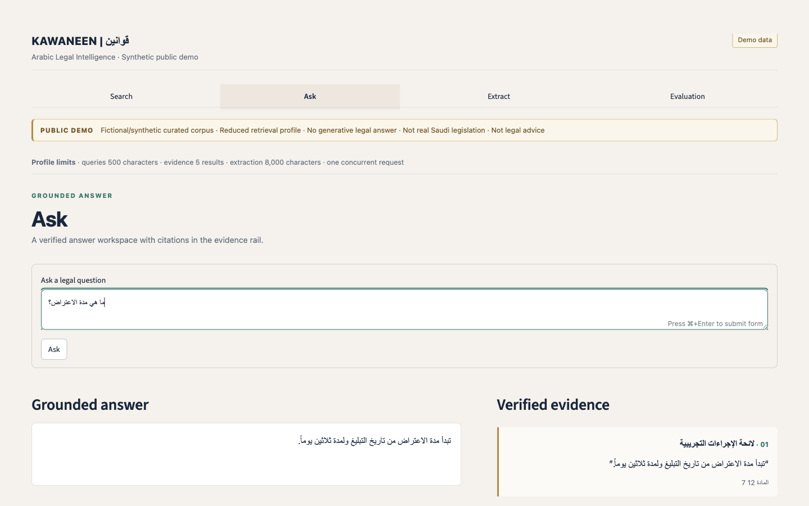
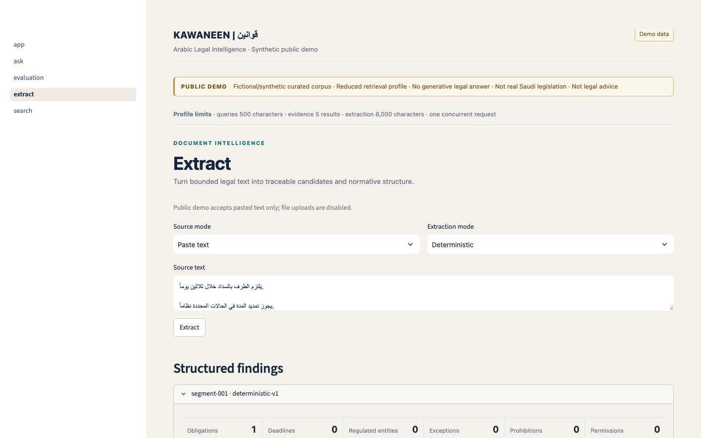
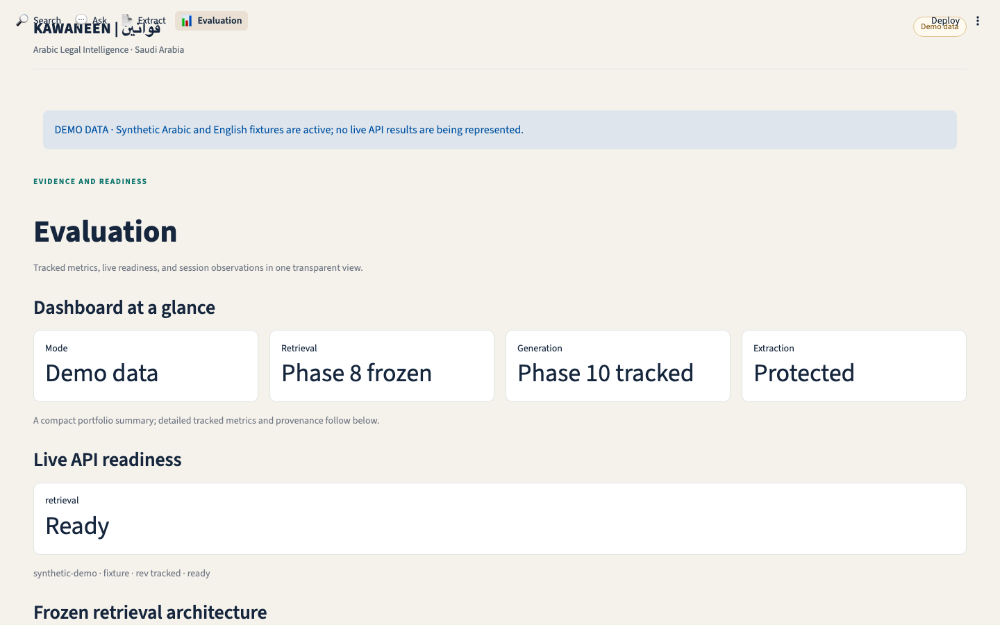

# Kawaneen

Kawaneen is a jurisdiction-aware Arabic legal and regulatory intelligence system. The current release includes the Phase 7–11 frozen retrieval, grounding, generation-policy, and extraction primitives plus the Phase 12 production serving boundary.

The serving API is intentionally scoped to Saudi Arabia (`SA`) and exposes search, grounded answers, structured extraction, canonical document reads, readiness, and model capability metadata. Missing local corpus/model assets produce degraded readiness instead of opaque startup failures.

## Quick start

```bash
uv sync --locked --dev
uv run kawaneen --version
uv run kawaneen doctor
uv run kawaneen api serve
make check
```

See [the API guide](docs/api.md), [development.md](docs/development.md), and [the Phase 12 report](docs/reports/phase-12-api-report.md) for the serving contract and verification record.

## Public reproduction and observed local API

The repository is authoritative for the six reported aggregate results. Rebuild
and verify the table without private data, model caches, network access, or
MLflow:

```bash
uv sync --locked --dev
make phase16-reproduce
```

For opt-in local MLflow request traces:

```bash
make install-observability
make mlflow-serve
# in another terminal
make api-serve-observed
```

MLflow storage is local and ignored. Raw queries, legal text, answers, and
extraction text are never traced. Full raw-data experiment reruns require the
corresponding private/local evaluation assets.

Testing layers and the public synthetic harness are documented in
[docs/testing.md](docs/testing.md). Run `make test-regression` for the hermetic
behavior lock or `make test-e2e` for the Docker Compose E2E harness.

## Product Interface

Phase 13 adds a recruiter-facing Streamlit workspace over the Phase 12 HTTP API. It is an evidence-first legal research interface—not a chatbot—with four screens:

- Search: ranked Saudi evidence, literal query highlighting, metadata, and returned-evidence refinement.
- Ask: grounded answers with a prominent citation rail, exact quotes, canonical-unit inspection, and intentional abstention states.
- Extract: paste, upload, or paginated corpus sources with bounded segmentation, visible hybrid limitations, and JSON/CSV exports.
- Evaluation: model capability snapshots, provenance-hashed tracked metrics, and current-session latency labelled as non-benchmark.

Run the live API and UI as two processes:

```bash
make api-serve
make ui-serve
```

For a public, synthetic portfolio walkthrough use:

```bash
make ui-demo
```

Demo mode is labelled persistently as `DEMO DATA`; it never masquerades as a live system. Fixtures and visual artifacts are synthetic only. The UI uses the Phase 12 `/v1` HTTP boundary and does not import model-serving or retrieval runtime services.

### Visual QA artifacts

The following screenshots are rendered at 1440×900 from the synthetic portfolio
demo state. They contain no private or production legal data.

[](docs/assets/ui/search.png)

| Ask | Extract | Evaluation |
| --- | --- | --- |
| [](docs/assets/ui/ask.png) | [](docs/assets/ui/extract.png) | [](docs/assets/ui/evaluation.png) |
